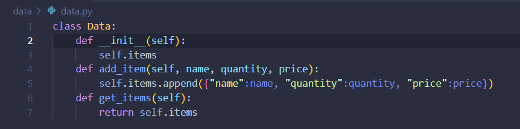
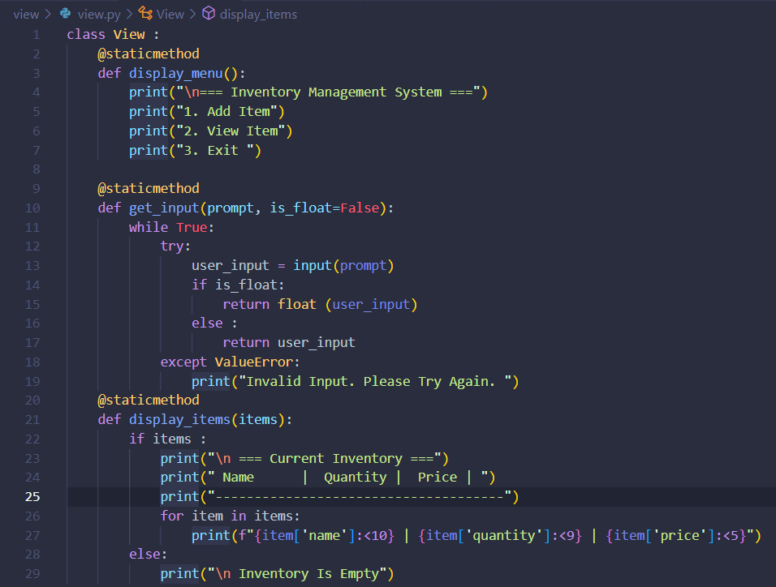
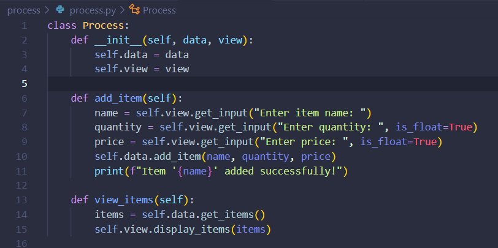
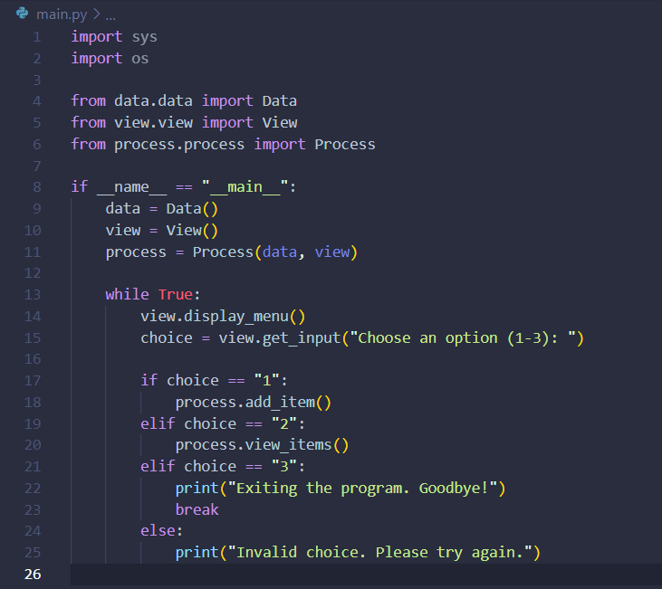
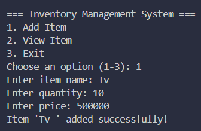

# UAS 

Program ini dirancang untuk mengelola inventaris barang dengan memanfaatkan pemrograman modular yang memisahkan logika, data, dan antarmuka pengguna. Komponen utama program terdiri dari tiga class utama: Data, View, dan Process, yang diintegrasikan melalui file main.py. 

Link Youtube : 

## Class Data 

Class Data bertanggung jawab untuk menyimpan dan mengelola data barang dalam bentuk list. Setiap barang direpresentasikan sebagai dictionary yang berisi nama, jumlah, dan harga. Class ini menyediakan dua metode utama: add_item, yang digunakan untuk menambahkan barang baru ke dalam list, dan get_items, yang mengembalikan semua barang yang tersimpan.

- __init__(self): 
 
Konstruktor yang menginisialisasi atribut self.items, yaitu list kosong yang akan digunakan untuk menyimpan barang.

- add_item(self, item): 

Menambahkan dictionary item ke dalam list self.items.

- get_items(self):

Mengembalikan semua item dalam list self.items.

## Class View 

Class View berfungsi sebagai antarmuka pengguna, menyediakan metode untuk menampilkan menu, menerima input, dan menampilkan data inventaris dalam format tabel. Metode display_menu menampilkan opsi utama seperti menambah barang, melihat barang, dan keluar dari program. Metode get_input memungkinkan validasi input, baik untuk string maupun angka, sementara metode display_items menyajikan data inventaris dalam bentuk tabel atau pesan jika inventaris kosong.

- display_menu():

   - Menampilkan menu utama aplikasi.
   - Menu berisi opsi: Tambah Item, Lihat Item, Keluar.

- get_input(prompt, is_float=False):

   - Meminta input dari pengguna.

   - Parameter:
     prompt: Pesan yang ditampilkan kepada pengguna.
     is_float: Jika True, input harus berupa angka (integer/float).

 - Menampilkan pesan kesalahan jika input tidak valid.

- display_items(items): 

  - Menampilkan semua barang dalam inventaris. Jika inventaris kosong, menampilkan pesan "Inventory is empty".

## Class Process 

Class Process bertugas mengimplementasikan logika bisnis. Class ini menghubungkan Data untuk penyimpanan data dan View untuk interaksi dengan pengguna. Metode add_item meminta input pengguna untuk nama, jumlah, dan harga barang, lalu menyimpannya ke dalam inventaris menggunakan metode di Data. Metode view_items mengambil semua data dari Data dan menampilkannya menggunakan View.  

- __init__(self, data, view):

    - Konstruktor yang menerima objek Data dan View sebagai parameter.

- add_item(self):

    - Meminta input dari pengguna untuk nama, jumlah, dan harga barang.
    - Menyimpan barang baru ke dalam inventaris menggunakan Data.  add_item ().

 - view_items(self):

    - Mengambil semua barang dari inventaris menggunakan Data.get_items().
    - Menampilkan barang menggunakan View.display_items().

## Main

File main.py adalah entry point program yang mengintegrasikan semua class. Program dimulai dengan membuat objek Data, View, dan Process, lalu menjalankan loop utama. Di dalam loop, menu ditampilkan menggunakan View, dan input pengguna diarahkan untuk menambah barang, melihat barang, atau keluar dari program. Pilihan yang tidak valid ditangani dengan pesan kesalahan, memastikan pengguna hanya memberikan input yang benar.

## Hasil Kode Program 

